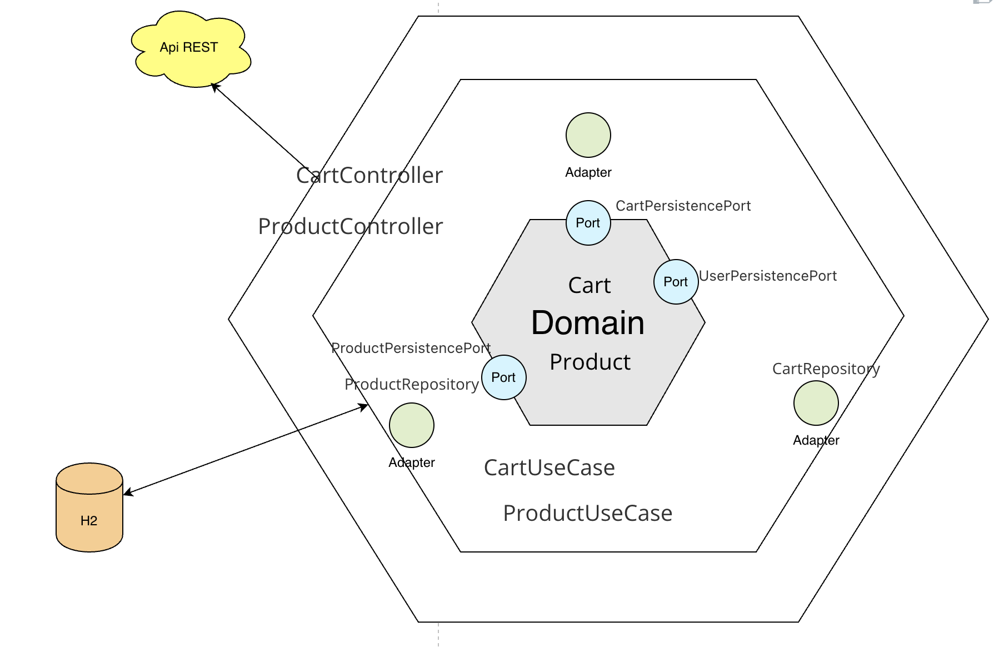
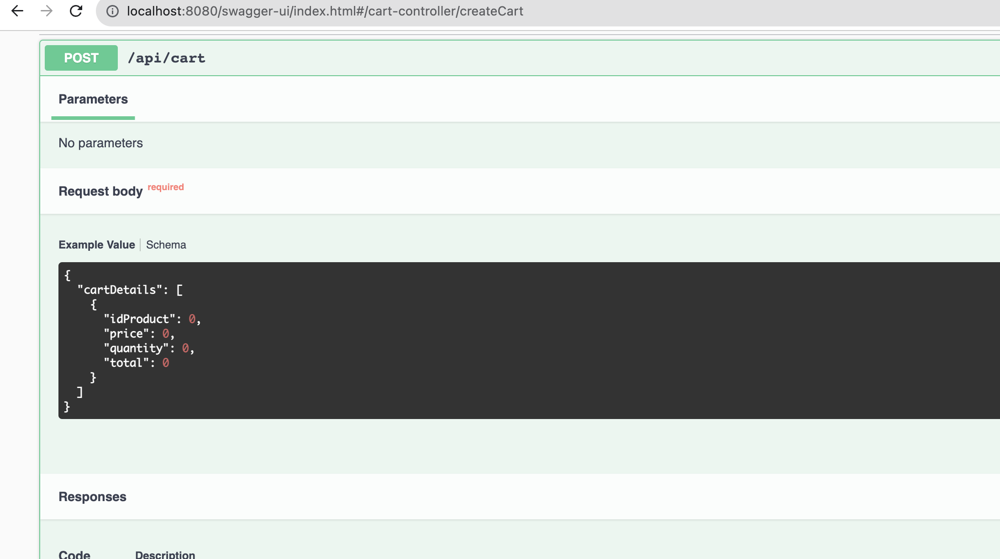
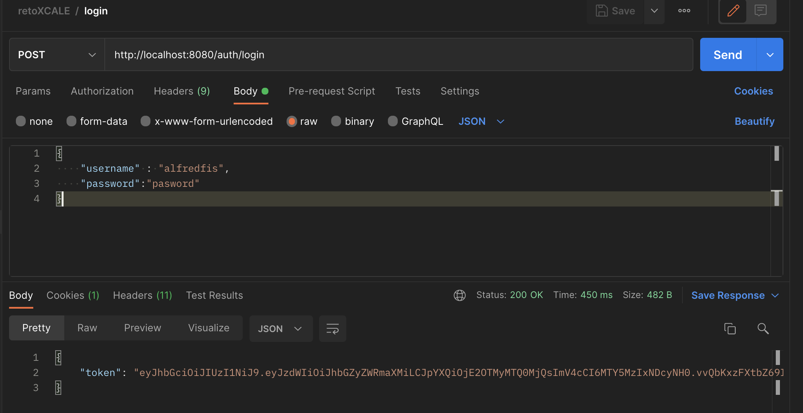
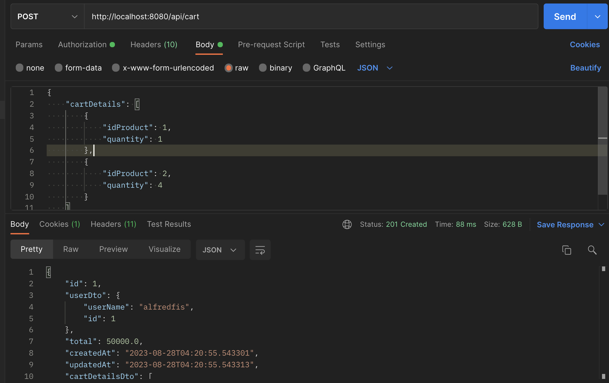
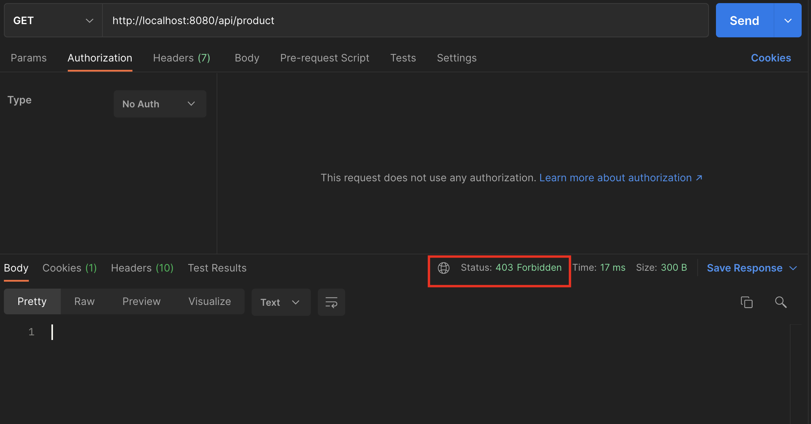

# reto-ecommerce
# Spring Web API REST with H2 Database with architecture hexagonal

This is a simple example of a Spring Web 3.1.2 API REST application that uses an H2 in-memory database. The application demonstrates basic CRUD (Create, Read, Update, Delete) operations for a resource.

## Prerequisites

- Java 17 or higher
- Maven

## Technologies Used

- Spring Boot 3.1.2
- Spring Web
- Spring quartz
- H2 Database (In-memory)
- JWT
- Spring security ( generarion de token)

## Getting Started

1. Clone the repository:
   git clone https://github.com/alfredjava/retoxcale
   cd retoxcale
2. Build the project:
   mvn clean package
3. Run the application:
4. mvn spring-boot:run

   The application will start on `http://localhost:8080`.

   ## API Endpoints

   The following are the available API endpoints:
- **Ruta publica register y login**
- POST /auth/login
- El aplicativo cuenta con un usuario cargado
  {
  "username" : "alfredfis",
  "password":"pasword"
  }

Si se genera el token todas las compras perteneceran al usuario alfredfis 
- POST /auth/register  (se puede crear mas usuario)
- **List All Product** ( se debe de usar una autorizacion)
- GET /api/product
    - 
- **List cart**
- GET /api/cart/1

- **saveProduct**
- POST /api/product
    - Request Body:
      {
      "name":"Iphone 13",
      "description":"Iphone 13",
      "stock":10,
      "price": 100000
      }
- - **saveCart**
- POST /api/cart
    - Request Body:
      {
      "cartDetails": [
      {
      "idProduct": 1,
      "quantity": 1
      },
      {
      "idProduct": 2,
      "quantity": 4
      }
      ]
      }
## Descargar collection de postman
[retoXCALE.postman_collection.json](retoXCALE.postman_collection.json)
## Diagrama

## swagger

http://localhost:8080/swagger-ui/index.html
## evidencia de pruebas
- Login

- Cart

- Seguridad sin token

